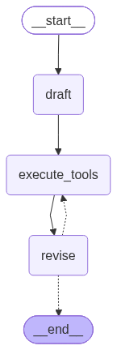

# reflexion-agent

A **Reflexion agent** built with [LangGraph](https://langchain-ai.github.io/langgraph/) and Gemini.
The model writes an answer, critiques it, searches the web to fill the gaps, and rewrites the
answer with citations. It repeats this for a fixed number of rounds.

## How it works



```
START → draft → execute_tools → revise ──┐
                     ▲                   │ (conditional)
                     └── search again ◄──┤
                                         └──► END
```

1. **draft (actor):** writes a ~250-word answer, a harsh self-critique (`missing` / `superfluous`)
   and 1–3 search queries.
2. **execute_tools:** runs the queries on Tavily web search and adds the results to the conversation.
3. **revise (revisor):** rewrites the answer using the search results, adds numbered citations and a
   `references` list, and keeps it under 250 words. It also produces a new critique and new queries.
4. **event_loop:** counts search rounds. At `MAX_ITERATIONS` (2) it ends, otherwise it searches again.

The model is forced to call a tool (`AnswerQuestion` / `ReviseAnswer`), so every reply is structured.
The final answer is in the last message's tool-call args.

## Project structure

| File | Role |
|---|---|
| `main.py` | Entry point: saves `graph.png`, runs the graph, prints the answer and references. |
| `graph.py` | Builds the LangGraph, including `event_loop` and `MAX_ITERATIONS`. |
| `schema.py` | Pydantic schemas: `Reflection`, `AnswerQuestion`, `ReviseAnswer`. |
| `chain.py` | Shared prompt plus the `first_responder` and `revisor` chains. |
| `llm.py` | `LLM` class: wraps `init_chat_model` for any `provider:model`, with retries and forced tool binding. |
| `actor_agent.py` | `draft_node` graph node. |
| `revisor_agent.py` | `revise_node` graph node. |
| `tool_executor.py` | Tavily search wrapped as a `ToolNode`. |

## Setup

Requires Python 3.10+ and [Poetry](https://python-poetry.org/).

```bash
poetry install
```

Create a `.env` file:

```
GOOGLE_API_KEY=...
TAVILY_API_KEY=...
# optional LangSmith tracing
LANGSMITH_API_KEY=...
LANGCHAIN_PROJECT=...
LANGSMITH_ENDPOINT=...
```

## LangSmith tracing (optional)

[LangSmith](https://smith.langchain.com/) records every run of the graph, so you can inspect each
step: the draft, the search queries and results, each revision, the tool calls, token usage and latency.
This is useful for seeing how the answer improves from round to round.

1. Create an API key in LangSmith and put it in `.env`:

   ```
   LANGSMITH_TRACING=true
   LANGSMITH_API_KEY=...
   LANGCHAIN_PROJECT=reflexion-agent
   LANGSMITH_ENDPOINT=https://api.smith.langchain.com
   ```

2. Run `poetry run python main.py` as usual. The run shows up under the project name in LangSmith.

Tracing is switched on by `LANGSMITH_TRACING=true`. Without it, the key alone does not enable tracing.
No code changes are needed, because LangChain and LangGraph pick the variables up automatically
(`load_dotenv()` loads them).

## Run

```bash
poetry run python main.py
```

The question is set in `main.py`. Edit the `content` string to ask something else.
Running `main.py` also rewrites `graph.png`, which is rendered through an online service
(mermaid.ink), so it needs internet access.

## Configuration

- **Models:** `chain.py` creates `actor_llm` and `revisor_llm`. Each takes a `provider:model` string,
  such as `google_genai:gemini-3.8-flash`, so the two roles can use different models or providers.
  Other providers need their own `langchain-*` package and API key.
- **Search rounds:** change `MAX_ITERATIONS` in `graph.py`.
- **Retries:** `LLM(max_retries=6)` retries transient errors such as Gemini 503 "high demand".
